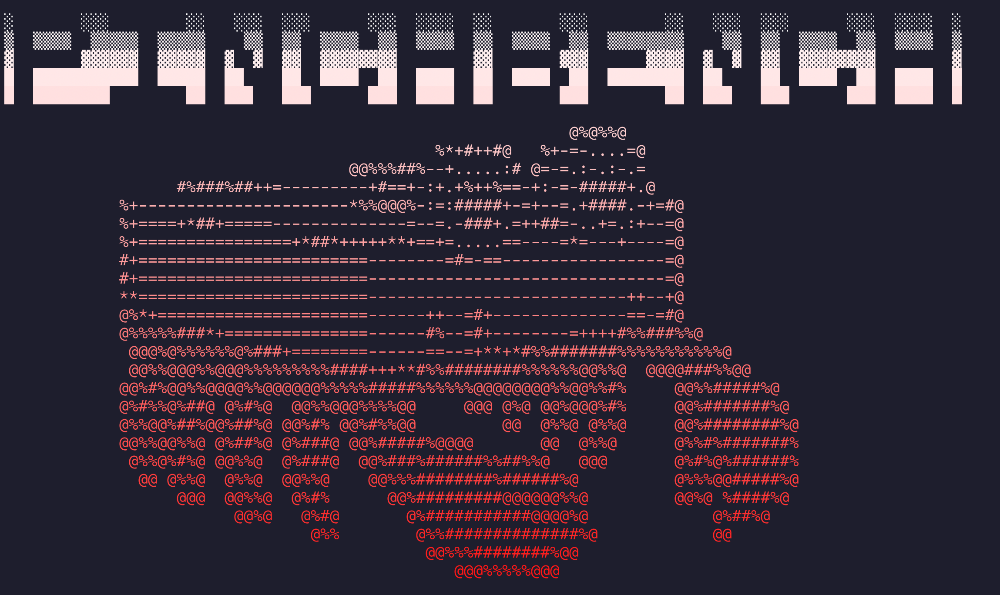

# 🦀 PinchBench

**Real-world benchmarks for AI coding agents**

[](https://pinchbench.com)
[](LICENSE)

PinchBench measures how well LLM models perform as the brain of an [OpenClaw](https://github.com/openclaw/openclaw) agent. Instead of synthetic tests, we throw real tasks at agents: scheduling meetings, writing code, triaging email, researching topics, and managing files.

Results are collected on a public leaderboard at **[pinchbench.com](https://pinchbench.com)**.



## Why PinchBench?

Most LLM benchmarks test isolated capabilities. PinchBench tests what actually matters for coding agents:

- **Tool usage** — Can the model call the right tools with the right parameters?
- **Multi-step reasoning** — Can it chain together actions to complete complex tasks?
- **Real-world messiness** — Can it handle ambiguous instructions and incomplete information?
- **Practical outcomes** — Did it actually create the file, send the email, or schedule the meeting?

## Quick Start

```bash
# Clone the skill
git clone https://github.com/pinchbench/skill.git
cd skill

# Run benchmarks with your model of choice
./scripts/run.sh --model anthropic/claude-sonnet-4

# Or run specific tasks
./scripts/run.sh --model openai/gpt-4o --suite task_01_calendar,task_02_stock
```

**Requirements:**
- Python 3.10+
- [uv](https://docs.astral.sh/uv/) package manager
- A running OpenClaw instance

## What Gets Tested

PinchBench includes 23 tasks across real-world categories:

| Category | Tasks | What's tested |
|----------|-------|---------------|
| **Productivity** | Calendar, daily summaries | Event creation, time parsing, scheduling |
| **Research** | Stock prices, conferences, markets | Web search, data extraction, synthesis |
| **Writing** | Blog posts, emails, humanization | Content generation, tone, formatting |
| **Coding** | Weather scripts, file structures | Code generation, file operations |
| **Analysis** | Spreadsheets, PDFs, documents | Data processing, summarization |
| **Email** | Triage, search | Inbox management, filtering |
| **Memory** | Context retrieval, knowledge management | Long-term memory, recall |
| **Skills** | ClawHub, skill discovery | OpenClaw ecosystem integration |

Each task is graded automatically, by an LLM judge, or both — ensuring both objective and nuanced evaluation.

## Submitting Results

To get your results on the leaderboard:

```bash
# Register for an API token (one-time)
./scripts/run.sh --register

# Run benchmark — results auto-upload with your token
./scripts/run.sh --model anthropic/claude-sonnet-4
```

Skip uploading with `--no-upload` if you just want local results.

## Command Reference

| Flag | Description |
|------|-------------|
| `--model MODEL` | **Required provider-qualified model** to test (e.g., `anthropic/claude-sonnet-4`, `openai-codex/gpt-5.3-codex`) |
| `--judge-model MODEL` | Provider-qualified model for LLM-judge tasks (default: `anthropic/claude-opus-4.5`) |
| `--suite SUITE` | `all`, `automated-only`, or comma-separated task IDs |
| `--thinking LEVEL` | Thinking level for benchmark turns (`off|minimal|low|medium|high|xhigh|adaptive`) |
| `--runs N` | Number of runs per task for averaging |
| `--timeout-multiplier N` | Scale timeouts for slower models |
| `--output-dir DIR` | Where to save results/checkpoints (default: `results/`) |
| `--judge-only FILE` | Re-run grading only (no task execution) from an existing results/checkpoint JSON |
| `--clear-sessions` | Clear stored OpenClaw session transcripts before each turn (default is keep/persistent) |
| `--no-upload` | Skip uploading to leaderboard |
| `--register` | Request an API token for submissions |
| `--upload FILE` | Upload a previous results JSON |

## Deterministic Model Routing (No Silent Fallbacks)

PinchBench now enforces strict model determinism for benchmark integrity:

- You must provide provider-qualified model refs (no bare model IDs)
- Requested models must exist and be available in local OpenClaw model catalog
- Runtime provider/model is verified on every task via transcript model snapshots
- Any provider/model mismatch fails the run immediately
- Judge execution is skipped when task execution fails

If a requested model is unavailable, PinchBench errors early with a suggestion when possible (for example `openrouter/<provider>/<model>`).

## Persistence, Checkpoints, and Re-Judging

- Sessions are now **persistent by default** (no auto cleanup between tasks)
- A rolling checkpoint is written during benchmark runs: `results/<run>_<model>.checkpoint.json`
- Final output includes full transcripts per task for audit + regrading workflows
- Use `--judge-only <results-or-checkpoint.json> --judge-model <provider/model>` to re-run grading with a different judge model without re-executing tasks
- Use `--clear-sessions` if you explicitly want old session transcripts deleted before each turn

## Contributing Tasks

We welcome new tasks! Check out [`tasks/TASK_TEMPLATE.md`](tasks/TASK_TEMPLATE.md) for the format. Good tasks are:

- **Real-world** — Something an actual user would ask an agent to do
- **Measurable** — Clear success criteria that can be graded
- **Reproducible** — Same task should produce consistent grading
- **Challenging** — Tests agent capabilities, not just LLM knowledge

## Links

- **Leaderboard:** [pinchbench.com](https://pinchbench.com)
- **OpenClaw:** [github.com/openclaw/openclaw](https://github.com/openclaw/openclaw)
- **Issues:** [github.com/pinchbench/skill/issues](https://github.com/pinchbench/skill/issues)

## License

MIT — see [LICENSE](LICENSE) for details.

---

*Claw-some AI agent testing* 🦞
