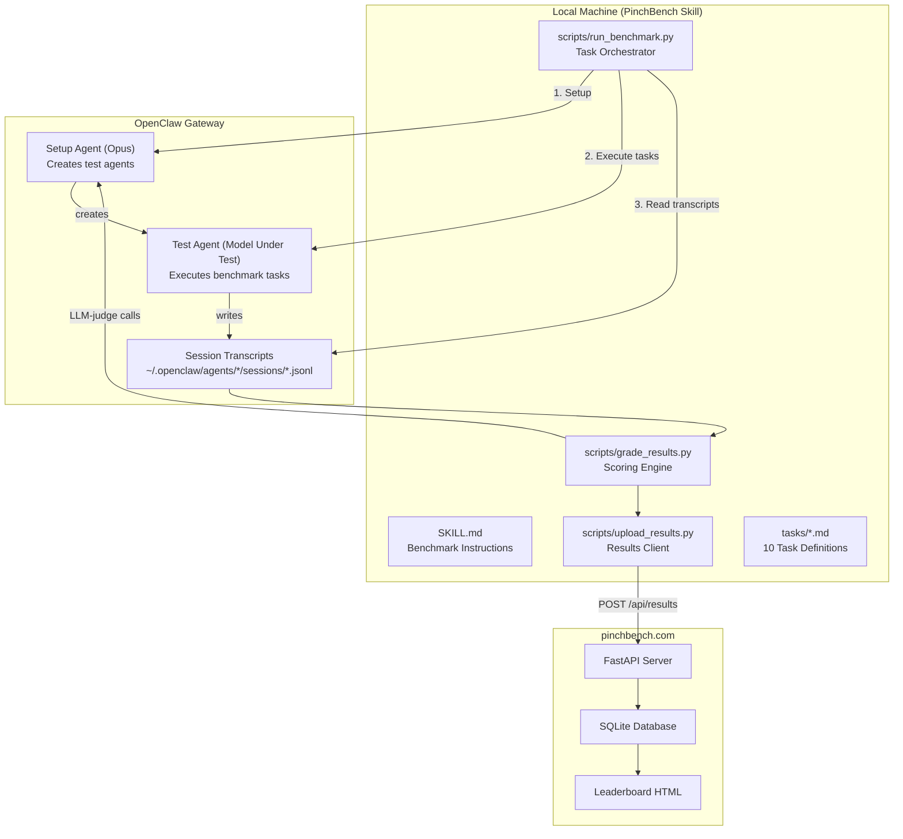

# PinchBench MVP - Orchestrator Build Prompt

## Project Overview

**Goal**: Build PinchBench, a benchmarking system that measures how well different LLM models perform as the "brain" of an OpenClaw agent. Results are collected on a central server at pinchbench.com with a public leaderboard.

**Key Analogy**: Like SWE-Bench or TerminalBench, but answering: _"How good is Model X when used as the default model for OpenClaw?"_

---

## Architecture Overview



---

## Execution Model: Three-Phase Design

### Phase 1: Setup (Claude Opus - Fixed)

- Creates test agent with target model configuration
- Prepares isolated workspace directories
- Not scored - just infrastructure

### Phase 2: Execution (Model Under Test)

- Runs each benchmark task against the test agent
- Each task gets a **fresh isolated workspace** (no cross-task state)
- Captures full transcript to JSONL
- Enforces per-task timeouts

### Phase 3: Judging (Claude Opus - Fixed)

- Automated checks run directly (Python code)
- LLM-as-judge tasks always use Opus for consistency
- Results aggregated and uploaded to server

**Why this separation**: Ensures we measure "can this model do real agentic tasks" not "can it bootstrap a benchmark system."

---

## Workspace Isolation Strategy

Each task runs in a completely isolated workspace:

- Path: `/tmp/pinchbench/{run_id}/{task_id}/`
- Fresh directory created before each task
- Pre-populated with any `workspace_files` specified in task definition
- No state carries over between tasks

**Benefits**:

- Tasks can run in any order
- No cascade failures
- Predictable grading (expected output is fixed)
- Easier debugging (self-contained failures)
- Parallelizable in future versions

---

## Subtask Breakdown

### SUBTASK 1: Skill Scaffold

**Mode**: Architect  
**Goal**: Design the skill structure and documentation

**Deliverables**:
| File | Purpose |
|------|---------|
| `SKILL.md` | YAML frontmatter + usage instructions |
| `tasks/TASK_TEMPLATE.md` | Template for task specifications |
| `references/grading_rubric.md` | Scoring methodology documentation |
| `references/architecture.md` | System design documentation |

**SKILL.md Structure**:

````yaml
---
name: PinchBench
description: Benchmark runner for evaluating LLM model performance in OpenClaw agents
---

# PinchBench Benchmark Skill

## Quick Start
Run benchmarks against configured models:
```bash
exec: python3 {baseDir}/scripts/run_benchmark.py --model anthropic/claude-sonnet-4 --suite all
````

## Prerequisites

- OpenClaw Gateway running locally
- API keys for models you want to test
- Network access for live tasks (optional)

## Usage Examples

### Test a single model

```bash
exec: python3 {baseDir}/scripts/run_benchmark.py --model anthropic/claude-sonnet-4
```

### Test specific tasks only

```bash
exec: python3 {baseDir}/scripts/run_benchmark.py --model openai/gpt-4.5 --suite task_01,task_02,task_03
```

### Run without uploading results

```bash
exec: python3 {baseDir}/scripts/run_benchmark.py --model anthropic/claude-opus-4.5 --no-upload
```

## Output

Results are saved to `results/{model_slug}_{timestamp}.json` and optionally uploaded to pinchbench.com.

````

**Task Specification Format** (each task in `tasks/`):
```yaml
---
id: task_01_calendar
name: Schedule Meeting
category: calendar
grading_type: automated  # automated | llm_judge | hybrid
timeout_seconds: 120
workspace_files: []  # Files to pre-populate in workspace
---

## Prompt
{What to send to the agent - this is the exact message}

## Expected Behavior
{What the agent should do - for documentation and judging}

## Grading Criteria
{Checklist of success criteria}

## Automated Checks (if grading_type includes automated)
```python
def grade(transcript: dict, workspace_path: str) -> dict:
    """
    Grade the task based on transcript and workspace state.

    Args:
        transcript: Parsed JSONL transcript as list of dicts
        workspace_path: Path to the task's workspace directory

    Returns:
        Dict mapping criterion names to scores (0.0 to 1.0)
    """
    scores = {}

    # Example: Check if agent created expected file
    if (Path(workspace_path) / "output.txt").exists():
        scores["file_created"] = 1.0
    else:
        scores["file_created"] = 0.0

    return scores
````

## LLM Judge Rubric (if grading_type includes llm_judge)

{Rubric text for Opus to score against}

````

---

### SUBTASK 2: Benchmark Orchestrator Script
**Mode**: Code
**File**: `scripts/run_benchmark.py`

**Responsibilities**:
1. Parse CLI arguments:
   - `--model`: Model identifier to test (e.g., `anthropic/claude-sonnet-4`)
   - `--suite`: Which tasks to run (`all`, `automated-only`, or comma-separated task IDs)
   - `--output-dir`: Results output directory (default: `results/`)
   - `--no-upload`: Skip uploading to server
   - `--timeout-multiplier`: Scale all task timeouts (default: 1.0)

2. Setup phase (using Opus via current agent):
   ```bash
   openclaw agents add bench-{model_slug} --model {model} --workspace /tmp/pinchbench-workspace
````

3. For each task:
   - Create isolated workspace: `/tmp/pinchbench/{run_id}/{task_id}/`
   - Copy any `workspace_files` from task spec to workspace
   - Execute: `openclaw agent --agent bench-{slug} --session-id {task_id}_{timestamp} --message "{prompt}"`
   - Wait for completion or timeout
   - Read transcript from `~/.openclaw/agents/bench-{slug}/sessions/{task_id}_{timestamp}.jsonl`
   - Pass to grader

4. Aggregate results into JSON report

5. Optionally upload via `upload_results.py`

**Key Implementation Details**:

```python
import subprocess
import json
import tempfile
import time
from pathlib import Path
from typing import Dict, List

def create_test_agent(model: str) -> str:
    """Create a test agent with the specified model."""
    model_slug = model.replace("/", "-").replace(".", "-")
    agent_id = f"bench-{model_slug}"

    # Check if agent already exists
    result = subprocess.run(
        ["openclaw", "agents", "list"],
        capture_output=True,
        text=True
    )

    if agent_id not in result.stdout:
        subprocess.run([
            "openclaw", "agents", "add", agent_id,
            "--model", model,
            "--workspace", "/tmp/pinchbench-workspace"
        ], check=True)

    return agent_id

def run_task(agent_id: str, task: dict, workspace: Path) -> dict:
    """Execute a single benchmark task."""
    session_id = f"{task['id']}_{int(time.time())}"

    # Prepare workspace
    workspace.mkdir(parents=True, exist_ok=True)
    for file_spec in task.get("workspace_files", []):
        # Copy pre-defined files into workspace
        pass

    # Run agent command
    try:
        result = subprocess.run([
            "openclaw", "agent",
            "--agent", agent_id,
            "--session-id", session_id,
            "--message", task["prompt"]
        ], capture_output=True, timeout=task["timeout_seconds"], text=True)

        exit_code = result.returncode
        timed_out = False
    except subprocess.TimeoutExpired:
        exit_code = -1
        timed_out = True

    # Read transcript
    transcript_path = (
        Path.home() / ".openclaw" / "agents" / agent_id /
        "sessions" / f"{session_id}.jsonl"
    )

    transcript = []
    if transcript_path.exists():
        with open(transcript_path) as f:
            for line in f:
                transcript.append(json.loads(line))

    return {
        "transcript": transcript,
        "workspace": str(workspace),
        "exit_code": exit_code,
        "timed_out": timed_out
    }

def main():
    parser = argparse.ArgumentParser(description="Run PinchBench benchmarks")
    parser.add_argument("--model", required=True, help="Model to test")
    parser.add_argument("--suite", default="all", help="Tasks to run")
    parser.add_argument("--output-dir", default="results", help="Output directory")
    parser.add_argument("--no-upload", action="store_true", help="Skip upload")
    args = parser.parse_args()

    # Load tasks
    tasks = load_tasks(args.suite)

    # Create test agent
    agent_id = create_test_agent(args.model)

    # Run tasks
    run_id = int(time.time())
    results = []

    for task in tasks:
        print(f"Running {task['id']}...")
        workspace = Path(f"/tmp/pinchbench/{run_id}/{task['id']}")

        execution_result = run_task(agent_id, task, workspace)
        grade_result = grade_task(task, execution_result)

        results.append({
            "task_id": task["id"],
            "score": grade_result["score"],
            "max_score": grade_result["max_score"],
            "breakdown": grade_result["breakdown"],
            "timed_out": execution_result["timed_out"]
        })

    # Save results
    output = {
        "model": args.model,
        "timestamp": time.time(),
        "results": results,
        "total_score": sum(r["score"] for r in results),
        "max_score": sum(r["max_score"] for r in results)
    }

    output_path = Path(args.output_dir) / f"{agent_id}_{run_id}.json"
    output_path.parent.mkdir(exist_ok=True)
    with open(output_path, "w") as f:
        json.dump(output, f, indent=2)

    print(f"Results saved to {output_path}")

    # Upload if requested
    if not args.no_upload:
        subprocess.run(["python3", "scripts/upload_results.py", str(output_path)])
```

---

### SUBTASK 3: Grading Engine

**Mode**: Code  
**File**: `scripts/grade_results.py`

**Responsibilities**:

1. Load task definition (for grading criteria)
2. Based on `grading_type`:
   - `automated`: Execute Python grading function from task spec
   - `llm_judge`: Call Opus with rubric + transcript
   - `hybrid`: Both, with configurable weights (default: 50/50)

3. Return structured score:

```python
{
    "task_id": "task_01_calendar",
    "score": 0.85,
    "max_score": 1.0,
    "grading_type": "automated",
    "breakdown": {
        "date_correct": 1.0,
        "time_correct": 1.0,
        "attendee_present": 0.5,
        "title_correct": 1.0
    },
    "notes": "Attendee email had typo"
}
```

**Implementation**:

```python
import json
import re
from pathlib import Path
from typing import Dict, Any

def grade_task(task: dict, execution_result: dict) -> dict:
    """Grade a task based on its grading type."""
    grading_type = task["grading_type"]

    if grading_type == "automated":
        return grade_automated(task, execution_result)
    elif grading_type == "llm_judge":
        return grade_llm_judge(task, execution_result)
    elif grading_type == "hybrid":
        auto_result = grade_automated(task, execution_result)
        llm_result = grade_llm_judge(task, execution_result)
        return combine_grades(auto_result, llm_result)
    else:
        raise ValueError(f"Unknown grading type: {grading_type}")

def grade_automated(task: dict, execution_result: dict) -> dict:
    """Execute automated grading function from task spec."""
    # Extract grading function from task markdown
    grading_code = extract_grading_code(task)

    # Execute in isolated namespace
    namespace = {}
    exec(grading_code, namespace)
    grade_func = namespace["grade"]

    # Call grading function
    scores = grade_func(
        execution_result["transcript"],
        execution_result["workspace"]
    )

    # Calculate total score
    total = sum(scores.values()) / len(scores) if scores else 0.0

    return {
        "task_id": task["id"],
        "score": total,
        "max_score": 1.0,
        "grading_type": "automated",
        "breakdown": scores,
        "notes": ""
    }

def grade_llm_judge(task: dict, execution_result: dict) -> dict:
    """Use Opus to judge task performance."""

    # Summarize transcript for judging
    transcript_summary = summarize_transcript(execution_result["transcript"])

    # Build judge prompt
    prompt = f"""You are grading an AI agent's performance on a task.

## Task
{task['prompt']}

## Expected Behavior
{task.get('expected_behavior', 'See grading criteria')}

## Agent's Transcript (summarized)
{transcript_summary}

## Grading Rubric
{task.get('llm_judge_rubric', task.get('grading_criteria', ''))}

Score each criterion from 0.0 to 1.0. Provide brief justification for each score.
Output as JSON: {{"scores": {{"criterion": score, ...}}, "total": weighted_average, "notes": "brief explanation"}}
"""

    # Call Opus (via OpenClaw or direct API)
    response = call_opus_for_judging(prompt)
    result = json.loads(response)

    return {
        "task_id": task["id"],
        "score": result["total"],
        "max_score": 1.0,
        "grading_type": "llm_judge",
        "breakdown": result["scores"],
        "notes": result["notes"]
    }

def summarize_transcript(transcript: list) -> str:
    """Create a concise summary of the transcript for judging."""
    summary_parts = []

    for event in transcript:
        if event.get("type") == "message":
            msg = event["message"]
            role = msg.get("role")

            if role == "assistant":
                # Extract tool calls
                for item in msg.get("content", []):
                    if item.get("type") == "toolCall":
                        summary_parts.append(
                            f"Tool: {item['name']}({json.dumps(item.get('arguments', {}))})"
                        )
            elif role == "toolResult":
                # Extract tool results
                content = msg.get("content", [])
                if content:
                    result_preview = str(content[0])[:200]
                    summary_parts.append(f"Result: {result_preview}")

    return "\n".join(summary_parts)

def call_opus_for_judging(prompt: str) -> str:
    """Call Claude Opus for LLM-as-judge grading."""
    # Option 1: Use OpenClaw Gateway API
    import requests
    response = requests.post("http://localhost:18789/api/chat", json={
        "model": "anthropic/claude-opus-4.5",
        "messages": [{"role": "user", "content": prompt}]
    })
    return response.json()["content"]

    # Option 2: Direct Anthropic API call
    # import anthropic
    # client = anthropic.Anthropic()
    # message = client.messages.create(
    #     model="claude-opus-4.5",
    #     messages=[{"role": "user", "content": prompt}]
    # )
    # return message.content[0].text
```

---

### SUBTASK 4: Task Definitions (10 tasks)

**Mode**: Code  
**Location**: `tasks/`

| #   | Task ID            | Category      | Grading   | What It Tests                 |
| --- | ------------------ | ------------- | --------- | ----------------------------- |
| 1   | `task_01_calendar` | Calendar      | Automated | Tool usage, date parsing      |
| 2   | `task_02_stock`    | Research      | Automated | Web search, number extraction |
| 3   | `task_03_blog`     | Writing       | LLM Judge | Content quality, style        |
| 4   | `task_04_weather`  | Coding        | Automated | Script writing, API calls     |
| 5   | `task_05_summary`  | Comprehension | LLM Judge | Reading, synthesis            |
| 6   | `task_06_events`   | Research      | LLM Judge | Multi-source research         |
| 7   | `task_07_email`    | Writing       | LLM Judge | Tone, professionalism         |
| 8   | `task_08_memory`   | Context       | Automated | Memory retrieval from files   |
| 9   | `task_09_files`    | File Ops      | Automated | File/directory creation       |
| 10  | `task_10_workflow` | Complex       | Hybrid    | Multi-step coordination       |

**Task Distribution**:

- Automated grading: 5 tasks (50%)
- LLM Judge grading: 4 tasks (40%)
- Hybrid grading: 1 task (10%)

Each task file must include all sections from TASK_TEMPLATE.md.

**Example Task: task_01_calendar.md**

````yaml
---
id: task_01_calendar
name: Schedule Meeting
category: calendar
grading_type: automated
timeout_seconds: 120
workspace_files: []
---

## Prompt
Schedule a meeting for next Tuesday at 3pm with john@example.com. Title it "Project Sync" and add a note about discussing the Q1 roadmap.

## Expected Behavior
The agent should use calendar/scheduling tools or create an ICS file to represent the meeting event.

## Grading Criteria
- [ ] Event created with correct date (next Tuesday)
- [ ] Time is 3:00 PM
- [ ] Attendee john@example.com included
- [ ] Title matches "Project Sync"
- [ ] Note/description mentions roadmap

## Automated Checks
```python
def grade(transcript: dict, workspace_path: str) -> dict:
    from pathlib import Path
    import re
    from datetime import datetime, timedelta

    scores = {}

    # Calculate next Tuesday
    today = datetime.now()
    days_ahead = (1 - today.weekday()) % 7  # Tuesday is 1
    if days_ahead == 0:
        days_ahead = 7
    next_tuesday = today + timedelta(days=days_ahead)

    # Check for ICS file or calendar tool calls
    workspace = Path(workspace_path)
    ics_files = list(workspace.glob("*.ics"))

    if ics_files:
        # Parse ICS file
        with open(ics_files[0]) as f:
            ics_content = f.read()

        # Check date
        date_match = re.search(r'DTSTART.*?(\d{8})', ics_content)
        if date_match:
            event_date = date_match.group(1)
            expected_date = next_tuesday.strftime("%Y%m%d")
            scores["date_correct"] = 1.0 if event_date == expected_date else 0.0
        else:
            scores["date_correct"] = 0.0

        # Check time (15:00)
        time_match = re.search(r'DTSTART.*?T(\d{6})', ics_content)
        if time_match:
            event_time = time_match.group(1)
            scores["time_correct"] = 1.0 if event_time.startswith("1500") else 0.0
        else:
            scores["time_correct"] = 0.0

        # Check attendee
        scores["attendee_present"] = 1.0 if "john@example.com" in ics_content else 0.0

        # Check title
        scores["title_correct"] = 1.0 if "Project Sync" in ics_content else 0.0

        # Check description
        scores["description_present"] = 1.0 if "roadmap" in ics_content.lower() else 0.0
    else:
        # Check transcript for calendar tool usage
        calendar_tool_used = any(
            event.get("message", {}).get("content", [{}])[0].get("name") == "calendar"
            for event in transcript
            if event.get("type") == "message"
        )

        if calendar_tool_used:
            # Partial credit for attempting calendar tool
            scores = {
                "date_correct": 0.5,
                "time_correct": 0.5,
                "attendee_present": 0.5,
                "title_correct": 0.5,
                "description_present": 0.5
            }
        else:
            scores = {
                "date_correct": 0.0,
                "time_correct": 0.0,
                "attendee_present": 0.0,
                "title_correct": 0.0,
                "description_present": 0.0
            }

    return scores
````

````

---

### SUBTASK 5: Upload Client
**Mode**: Code
**File**: `scripts/upload_results.py`

**Responsibilities**:
```python
import json
import uuid
import requests
import sys
from datetime import datetime
from pathlib import Path

def get_openclaw_version() -> str:
    """Get OpenClaw version from CLI."""
    import subprocess
    result = subprocess.run(
        ["openclaw", "--version"],
        capture_output=True,
        text=True
    )
    return result.stdout.strip()

def upload_results(results_path: str, server_url: str = "https://pinchbench.com"):
    """Upload benchmark results to the central server."""
    with open(results_path) as f:
        results = json.load(f)

    # Build submission payload
    payload = {
        "submission_id": str(uuid.uuid4()),
        "timestamp": datetime.utcnow().isoformat(),
        "openclaw_version": get_openclaw_version(),
        "model": results["model"],
        "provider": results["model"].split("/")[0],
        "task_results": results["results"],
        "total_score": results["total_score"],
        "max_score": results["max_score"],
        "metadata": {
            "run_timestamp": results["timestamp"],
            "task_count": len(results["results"])
        }
    }

    # POST to server
    try:
        response = requests.post(
            f"{server_url}/api/results",
            json=payload,
            timeout=30
        )
        response.raise_for_status()

        result = response.json()
        print(f"✓ Submission successful!")
        print(f"  Submission ID: {result['submission_id']}")
        print(f"  Rank: #{result['rank']}")
        print(f"  View leaderboard: {server_url}")

    except requests.exceptions.RequestException as e:
        print(f"✗ Upload failed: {e}", file=sys.stderr)
        sys.exit(1)

if __name__ == "__main__":
    if len(sys.argv) < 2:
        print("Usage: python upload_results.py <results_file.json>")
        sys.exit(1)

    upload_results(sys.argv[1])
````

---

### SUBTASK 6: Central Server

**Mode**: Code  
**Location**: `server/`

**Directory Structure**:

```
server/
├── main.py              # FastAPI application
├── models.py            # Pydantic schemas
├── database.py          # SQLite setup
├── routers/
│   ├── results.py       # POST /api/results
│   └── leaderboard.py   # GET /api/leaderboard
├── templates/
│   └── leaderboard.html # Jinja2 template
├── static/
│   └── style.css        # Basic styling
└── requirements.txt     # Dependencies
```

**main.py**:

```python
from fastapi import FastAPI
from fastapi.staticfiles import StaticFiles
from fastapi.templating import Jinja2Templates
from routers import results, leaderboard
from database import init_db

app = FastAPI(title="PinchBench API")

# Initialize database
init_db()

# Mount routers
app.include_router(results.router, prefix="/api")
app.include_router(leaderboard.router)

# Static files
app.mount("/static", StaticFiles(directory="static"), name="static")

if __name__ == "__main__":
    import uvicorn
    uvicorn.run(app, host="0.0.0.0", port=8000)
```

**models.py**:

```python
from pydantic import BaseModel
from typing import List, Dict, Any

class TaskResult(BaseModel):
    task_id: str
    score: float
    max_score: float
    breakdown: Dict[str, float]
    timed_out: bool

class Submission(BaseModel):
    submission_id: str
    timestamp: str
    openclaw_version: str
    model: str
    provider: str
    task_results: List[TaskResult]
    total_score: float
    max_score: float
    metadata: Dict[str, Any] = {}

class LeaderboardEntry(BaseModel):
    rank: int
    model: str
    provider: str
    total_score: float
    max_score: float
    percentage: float
    timestamp: str
    submission_id: str
```

**database.py**:

```python
import sqlite3
from pathlib import Path

DB_PATH = Path("pinchbench.db")

def init_db():
    """Initialize the database schema."""
    conn = sqlite3.connect(DB_PATH)
    cursor = conn.cursor()

    cursor.execute("""
        CREATE TABLE IF NOT EXISTS submissions (
            id TEXT PRIMARY KEY,
            timestamp TEXT NOT NULL,
            model TEXT NOT NULL,
            provider TEXT NOT NULL,
            total_score REAL NOT NULL,
            max_score REAL NOT NULL,
            openclaw_version TEXT,
            raw_payload TEXT
        )
    """)

    cursor.execute("""
        CREATE TABLE IF NOT EXISTS task_results (
            id INTEGER PRIMARY KEY AUTOINCREMENT,
            submission_id TEXT NOT NULL,
            task_id TEXT NOT NULL,
            score REAL NOT NULL,
            max_score REAL NOT NULL,
            grading_type TEXT,
            notes TEXT,
            FOREIGN KEY (submission_id) REFERENCES submissions(id)
        )
    """)

    cursor.execute("""
        CREATE INDEX IF NOT EXISTS idx_submissions_model
        ON submissions(model)
    """)

    cursor.execute("""
        CREATE INDEX IF NOT EXISTS idx_submissions_score
        ON submissions(total_score DESC)
    """)

    conn.commit()
    conn.close()

def get_connection():
    """Get a database connection."""
    return sqlite3.connect(DB_PATH)
```

**routers/results.py**:

```python
from fastapi import APIRouter, HTTPException
from models import Submission
from database import get_connection
import json

router = APIRouter()

@router.post("/results")
async def submit_results(submission: Submission):
    """Accept benchmark results submission."""
    conn = get_connection()
    cursor = conn.cursor()

    try:
        # Insert submission
        cursor.execute("""
            INSERT INTO submissions (id, timestamp, model, provider, total_score, max_score, openclaw_version, raw_payload)
            VALUES (?, ?, ?, ?, ?, ?, ?, ?)
        """, (
            submission.submission_id,
            submission.timestamp,
            submission.model,
            submission.provider,
            submission.total_score,
            submission.max_score,
            submission.openclaw_version,
            submission.json()
        ))

        # Insert task results
        for task_result in submission.task_results:
            cursor.execute("""
                INSERT INTO task_results (submission_id, task_id, score, max_score, notes)
                VALUES (?, ?, ?, ?, ?)
            """, (
                submission.submission_id,
                task_result.task_id,
                task_result.score,
                task_result.max_score,
                json.dumps(task_result.breakdown)
            ))

        conn.commit()

        # Calculate rank
        cursor.execute("""
            SELECT COUNT(*) + 1 FROM submissions
            WHERE total_score > ?
        """, (submission.total_score,))
        rank = cursor.fetchone()[0]

        return {
            "submission_id": submission.submission_id,
            "rank": rank,
            "message": "Submission successful"
        }

    except Exception as e:
        conn.rollback()
        raise HTTPException(status_code=500, detail=str(e))
    finally:
        conn.close()
```

**routers/leaderboard.py**:

```python
from fastapi import APIRouter, Request
from fastapi.responses import HTMLResponse
from fastapi.templating import Jinja2Templates
from database import get_connection
from models import LeaderboardEntry
from typing import List

router = APIRouter()
templates = Jinja2Templates(directory="templates")

@router.get("/api/leaderboard")
async def get_leaderboard_json() -> List[LeaderboardEntry]:
    """Get leaderboard data as JSON."""
    conn = get_connection()
    cursor = conn.cursor()

    cursor.execute("""
        SELECT
            ROW_NUMBER() OVER (ORDER BY total_score DESC) as rank,
            model,
            provider,
            total_score,
            max_score,
            ROUND(total_score * 100.0 / max_score, 2) as percentage,
            timestamp,
            id
        FROM submissions
        ORDER BY total_score DESC
        LIMIT 100
    """)

    entries = []
    for row in cursor.fetchall():
        entries.append(LeaderboardEntry(
            rank=row[0],
            model=row[1],
            provider=row[2],
            total_score=row[3],
            max_score=row[4],
            percentage=row[5],
            timestamp=row[6],
            submission_id=row[7]
        ))

    conn.close()
    return entries

@router.get("/", response_class=HTMLResponse)
async def get_leaderboard_html(request: Request):
    """Render leaderboard HTML page."""
    entries = await get_leaderboard_json()
    return templates.TemplateResponse("leaderboard.html", {
        "request": request,
        "entries": entries
    })
```

**templates/leaderboard.html**:

```html
<!DOCTYPE html>
<html lang="en">
  <head>
    <meta charset="UTF-8" />
    <meta name="viewport" content="width=device-width, initial-scale=1.0" />
    <title>PinchBench Leaderboard</title>
    <link rel="stylesheet" href="/static/style.css" />
  </head>
  <body>
    <header>
      <h1>🏆 PinchBench Leaderboard</h1>
      <p>Benchmarking LLM models as OpenClaw agents</p>
    </header>

    <main>
      <table>
        <thead>
          <tr>
            <th>Rank</th>
            <th>Model</th>
            <th>Provider</th>
            <th>Score</th>
            <th>Percentage</th>
            <th>Submitted</th>
          </tr>
        </thead>
        <tbody>
          
          <tr>
            <td class="rank">{{ entry.rank }}</td>
            <td class="model">{{ entry.model }}</td>
            <td class="provider">{{ entry.provider }}</td>
            <td class="score">
              {{ entry.total_score }} / {{ entry.max_score }}
            </td>
            <td class="percentage">{{ entry.percentage }}%</td>
            <td class="timestamp">{{ entry.timestamp[:10] }}</td>
          </tr>
          
        </tbody>
      </table>
    </main>

    <footer>
      <p>Submit your own benchmarks using the PinchBench skill in OpenClaw</p>
    </footer>
  </body>
</html>
```

**requirements.txt**:

```
fastapi==0.104.1
uvicorn==0.24.0
jinja2==3.1.2
pydantic==2.5.0
```

---

## Technical Constraints

1. **Python 3.10+** for all scripts
2. **Minimal dependencies**: requests, pyyaml, fastapi, uvicorn, jinja2
3. **SQLite only** (no Postgres/Redis for MVP)
4. **Sequential execution** (no async/parallel for MVP)
5. **Local file paths** assume standard OpenClaw installation at `~/.openclaw/`
6. **Timeout handling**: Tasks that exceed timeout are killed and scored 0

---

## Success Criteria for MVP

- [ ] Skill can be installed in OpenClaw skills directory
- [ ] `run_benchmark.py` successfully creates test agents and runs tasks
- [ ] At least 10 tasks with clear grading criteria
- [ ] Both automated and LLM-judge grading work correctly
- [ ] Benchmark completes in <1 hour for 10 tasks × 1 model
- [ ] Results POST successfully to server
- [ ] Leaderboard displays rankings with model comparisons
- [ ] Documentation sufficient for others to run benchmarks

---

## Execution Order

1. **Architect Mode**: Design task format + skill structure → SKILL.md, templates, documentation
2. **Code Mode**: Build `run_benchmark.py` orchestrator
3. **Code Mode**: Build `grade_results.py` with both grading modes
4. **Code Mode**: Write 10 task definitions following template
5. **Code Mode**: Build FastAPI server with all endpoints
6. **Code Mode**: Build `upload_results.py` client
7. **Debug Mode**: Integration testing with real OpenClaw agents
8. **Code Mode**: Polish, error handling, logging, documentation

---

## Key Design Decisions

1. **Isolated Workspaces**: Each task runs in fresh `/tmp/pinchbench/{run_id}/{task_id}/` directory
   - Pros: No cascade failures, tasks can run in any order, easier debugging
   - Cons: Doesn't test multi-turn context accumulation (can add in v2)

2. **Three-Phase Execution**: Setup (Opus) → Execute (Model Under Test) → Judge (Opus)
   - Ensures fair testing of model capabilities, not infrastructure setup

3. **Mixed Grading**: 50% automated, 40% LLM-judge, 10% hybrid
   - Balances deterministic scoring with qualitative assessment

4. **Sequential Execution**: No parallelism in MVP
   - Simpler implementation, easier debugging, can optimize later

5. **Central Server**: Simple FastAPI + SQLite
   - Fast to build, easy to deploy, sufficient for MVP scale

---

## Future Enhancements (Post-MVP)

- Workflow tasks that build on each other (test multi-turn coherence)
- Parallel task execution for faster benchmarks
- More sophisticated LLM-judge prompts with chain-of-thought
- Task categories and filtered leaderboards
- Historical tracking of model performance over time
- Cost tracking per benchmark run
- Docker-based agent isolation for true sandboxing
